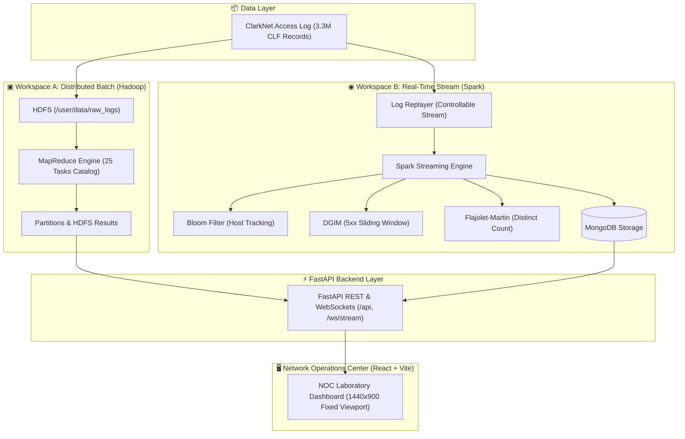

<div align="center">

```text
  ██████╗██╗      █████╗ ██████╗ ██╗  ██╗███╗   ██╗███████╗████████╗  █████╗ ███╗   ██╗██████╗ 
 ██╔════╝██║     ██╔══██╗██╔══██╗██║ ██╔╝████╗  ██║██╔════╝╚══██╔══╝ ██╔══██╗████╗  ██║██╔══██╗
 ██║     ██║     ███████║██████╔╝█████═╝ ██╔██╗ ██║█████╗     ██║    ███████║██╔██╗ ██║██████╔╝
 ██║     ██║     ██╔══██║██╔══██╗██╔═██╗ ██║╚██╗██║██╔══╝     ██║    ██╔══██║██║╚██╗██║██╔══██╗
 ╚██████╗███████╗██║  ██║██║  ██║██║  ██╗██║ ╚████║███████╗   ██║    ██║  ██║██║ ╚████║██████╔╝
  ╚═════╝╚══════╝╚═╝  ╚═╝╚═╝  ╚═╝╚═╝  ╚═╝╚═╝  ╚═══╝╚══════╝   ╚═╝    ╚═╝  ╚═╝╚═╝  ╚═══╝╚═════╝ 
```

### **ClarkNet Big Data Analytics Laboratory**
*A Distributed System & Streaming Analytics Platform for HTTP Access Logs*

---

[](https://fastapi.tiangolo.com/)
[](https://reactjs.org/)
[](https://hadoop.apache.org/)
[](https://spark.apache.org/)
[](https://www.mongodb.com/)
[](https://www.docker.com/)
[](LICENSE)

</div>

---

## 📋 Table of Contents

- [Overview](#-overview)
- [Architectural Design](#-architectural-design)
- [Dual-Workspace Model](#-dual-workspace-model)
  - [Workspace A: MapReduce Batch Analytics (25 Tasks)](#workspace-a-mapreduce-batch-analytics-25-tasks)
  - [Workspace B: Spark Streaming & Algorithm Lab](#workspace-b-spark-streaming--algorithm-lab)
- [Laboratory Interface & Navigation](#-laboratory-interface--navigation)
- [Dataset Specifications](#-dataset-specifications)
- [Tech Stack & System Components](#-tech-stack--system-components)
- [Getting Started](#-getting-started)
- [API Reference](#-api-reference)
- [Design System & UI Guidelines](#-design-system--ui-guidelines)
- [License](#-license)

---

## 🌐 Overview

The **ClarkNet Analytics Laboratory** is a production-grade, full-stack Big Data platform designed to perform historical batch analytics and real-time stream mining on the **ClarkNet HTTP access log dataset** (Internet Traffic Archive, 1995).

Built upon a decoupled architecture, the platform features a custom-designed **Network Operations Center (NOC)** frontend, a **FastAPI backend**, an **HDFS + MapReduce cluster** for distributed batch computations, and a **Spark Streaming pipeline** supporting approximate algorithms (Bloom Filter, DGIM, Flajolet-Martin) and predictive forecasting.

### Key Highlights
* **3.3M+ Historical Records**: Analyzes uncompressed Common Log Format (CLF) traces from August–September 1995.
* **Dual Workspaces**: Complete separation of HDFS/MapReduce batch processing from Spark Structured Streaming.
* **25 MapReduce Task Catalog**: Comprehensive analytical suite covering traffic volume, status code distributions, error patterns, bandwidth usage, and statistical security indicators.
* **Approximate Stream Mining**: Real-time evaluation of probabilistic algorithms vs. exact ground truth.
* **Fixed Viewport NOC Interface**: Designed specifically for high-density 1440×900 and 1280×720 viewports with zero page-level scroll.

---

## 🏗 Architectural Design



---

## ⚡ Dual-Workspace Model

### Workspace A: MapReduce Batch Analytics (25 Tasks)

Workspace A executes streaming MapReduce jobs over HDFS. Each job processes the full ClarkNet log to generate statistical aggregations across 4 core categories:

| Category | Task ID | Analysis Title | Mapper Script | Visualization |
|---|---|---|---|---|
| **Hosts & Volume** | `hosts` | Top Client IPs | `host_mapper.py` | Horizontal Bar |
| | `endpoints` | Top Requested Paths | `endpoint_mapper.py` | Horizontal Bar |
| | `extensions` | File Extension Distribution | `extension_mapper.py` | Bar Chart |
| | `methods` | HTTP Method Distribution | `method_mapper.py` | Pie Chart |
| | `hourly` | Requests by Hour (0-23) | `hour_mapper.py` | Line Chart |
| | `daily` | Requests by Day | `day_mapper.py` | Line Chart |
| | `hour_day` | Day × Hour Traffic Heatmap | `hour_day_mapper.py` | Heatmap Grid |
| **Responses & Errors** | `status` | HTTP Status Code Distribution | `status_mapper.py` | Bar Chart |
| | `status_4xx` | 4xx Client Error Breakdown | `status4xx_mapper.py` | Bar Chart |
| | `status_5xx` | 5xx Server Error Breakdown | `status5xx_mapper.py` | Bar Chart |
| | `error_paths` | Error-Producing Paths | `error_path_mapper.py` | Bar Chart |
| | `error_hosts` | High-Error Clients | `error_host_mapper.py` | Bar Chart |
| | `method_status`| Method × Status Cross-Tab | `method_status_mapper.py` | Stacked Bar |
| | `error_rate_day`| Daily Error Rates | `error_rate_day_mapper.py` | Dual Line |
| **Traffic** | `bytes_dist` | Response Size Distribution | `bytes_mapper.py` | Histogram |
| | `bytes_path` | Bandwidth by URL Path | `bytes_total_mapper.py` | Bar Chart |
| | `bytes_host` | Traffic Volume by Client IP | `host_bytes_mapper.py` | Bar Chart |
| | `host_concentration` | Client Traffic Share | `host_mapper.py` | Pareto Chart |
| | `path_popularity` | Resource Popularity | `endpoint_mapper.py` | Treemap |
| **Security & Outliers**| `high_rate_hosts` | High-Rate Clients | `host_mapper.py` | Bar Chart |
| | `failed_requests` | Repeated Failed Requests | `error_host_mapper.py` | Bar Chart |
| | `unusual_paths` | Least Common Requested Paths | `endpoint_mapper.py` | Data Table |
| | `suspicious_combos`| Unusual Method + Status | `method_status_mapper.py` | Data Table |
| | `rare_status` | Rare HTTP Status Codes | `status_mapper.py` | Data Table |
| | `malformed` | Unparseable CLF Records | `status_mapper.py` | Data Table |

#### Batch Features
* **Automated Findings**: Automatically derives statistical insights (e.g., top IP traffic concentration ratio, HTTP 200 health percentages).
* **Multi-Task Comparison**: Side-by-side split screen to compare any two batch analyses.
* **Reproducible Configurations**: Export run parameters to `.json` or download result datasets as `.csv`.

---

### Workspace B: Spark Streaming & Algorithm Lab

Workspace B simulates live web traffic by replaying the ClarkNet log through a controllable stream worker into Spark Streaming.

```text
┌────────────────────────────────────────────────────────────────────────┐
│                        SPARK STREAMING PIPELINE                        │
├────────────────────────────────────────────────────────────────────────┤
│  Replayer (0.25x - 10x Speed) ──> WebSocket Stream ──> Live Dashboard   │
│                                                                        │
│  [Algorithm 1] Bloom Filter       : New vs Seen Hosts (Constant Space) │
│  [Algorithm 2] DGIM Algorithm     : 5xx Count in Window (O(log² N))    │
│  [Algorithm 3] Flajolet-Martin    : Distinct Host Count (FM vs Exact)  │
│  [Predictor]   EWMA Forecast      : Next-Window Volume & Confidence    │
└────────────────────────────────────────────────────────────────────────┘
```

#### Stream Mining Algorithms
1. **Bloom Filter**: Efficient bit-vector set representation for identifying first-time visiting IPs vs. previously seen hosts with zero false negatives.
2. **DGIM Algorithm**: Maintains logarithmic buckets to estimate 5xx server error bits in a sliding window with a proven $\le 50\%$ error bound.
3. **Flajolet-Martin (FM)**: Approximates unique host cardinality using trailing zeros of hashed IP strings, evaluated against exact ground truth.
4. **EWMA Forecast**: Exponentially Weighted Moving Average predictor ($\alpha = 0.3$) computing next-window volume expectations and confidence bands without looking ahead.

---

## 🖥 Laboratory Interface & Navigation

The frontend is organized into 7 distinct application views:

1. **`Overview` (`/`)**: High-density NOC landing grid with core metrics, dataset summary, workspace shortcuts, live stream monitor, and infrastructure status.
2. **`Batch Workspace` (`/workspace-a`)**: HDFS/MapReduce task catalog, custom charts, automated text insights, side-by-side comparison, and CSV export.
3. **`Streaming Lab` (`/workspace-b`)**: Stream replay control bar, speed selector, live event log, traffic charts, algorithm diagnostic cards, and EWMA forecast panel.
4. **`Dataset Explorer` (`/dataset`)**: Common Log Format schema definition, interactive HDFS file browser (`/user/data/`), and DataNode storage breakdown.
5. **`System Health` (`/system`)**: Real-time service monitoring (FastAPI, HDFS, MongoDB, YARN, Spark), FSCK report, and cluster storage utilization.
6. **`Job History` (`/jobs`)**: Historical execution log of MapReduce batch runs and streaming sessions.
7. **`Settings` (`/settings`)**: Dataset HDFS upload trigger, service ports reference, and system documentation.

---

## 📊 Dataset Specifications

The platform uses the official **ClarkNet HTTP Access Log** from the Internet Traffic Archive:

* **Source**: ClarkNet WWW server (Metro Baltimore/DC Internet provider, 1995).
* **Timeframe**: August 28, 1995 – September 10, 1995 (2 full weeks).
* **Format**: Common Log Format (CLF):
  ```text
  host ident authuser [timestamp] "request" status bytes
  ```
* **Metrics**: ~3,300,000 requests | ~327 MB raw log file.

---

## 🛠 Tech Stack & System Components

* **Frontend**: React 18, Vite, React Router v6, Recharts, Lucide Icons, Vanilla CSS (NOC Dark System Tokens).
* **Backend**: FastAPI, Uvicorn, Asyncio WebSockets, Pydantic, Pandas.
* **Storage Layer**: HDFS (Hadoop 3.2.1), MongoDB 6.0 (`log_analytics` DB).
* **Processing Engines**: Hadoop Streaming MapReduce (Python), Apache Spark 3.x Structured Streaming.
* **Orchestration**: Docker Compose, Bash startup scripts (`start.sh`).

---

## 🚀 Getting Started

### Prerequisites
* **Docker** & **Docker Compose**
* **WSL2** (for Windows users) or **Linux/macOS**
* **Python 3.10+** & **Node.js 18+**

### Quickstart

1. **Clone the repository**:
   ```bash
   git clone https://github.com/dsomil/bdaproject.git
   cd bdaproject
   ```

2. **Make scripts executable**:
   ```bash
   chmod +x start.sh stop.sh
   ```

3. **Start the laboratory**:
   ```bash
   ./start.sh
   ```

4. **Open in Browser**:
   * **Laboratory UI**: [http://localhost:3000](http://localhost:3000)
   * **API Documentation**: [http://localhost:8000/docs](http://localhost:8000/docs)
   * **HDFS NameNode**: [http://localhost:9870](http://localhost:9870)
   * **YARN ResourceManager**: [http://localhost:8088](http://localhost:8088)

---

## 📡 API Reference

### Core Endpoints

| Endpoint | Method | Description |
|---|---|---|
| `/api/health` | `GET` | System health check (API, Mongo, HDFS, Dataset) |
| `/api/dataset` | `GET` | ClarkNet dataset line count, file size, and date range |
| `/api/mapreduce/catalog` | `GET` | Returns list of all 25 MapReduce tasks |
| `/api/mapreduce/results` | `GET` | Fetch results for a specific task (e.g. `?task=status`) |
| `/api/mapreduce/run` | `POST` | Trigger MapReduce job execution on HDFS |
| `/api/stream/start` | `POST` | Start real-time log replayer & stream job |
| `/api/stream/pause` | `POST` | Pause streaming pipeline |
| `/api/stream/stop` | `POST` | Stop streaming pipeline |
| `/api/metrics` | `GET` | Fetch recent window aggregates and algorithm stats |
| `/api/forecast` | `GET` | Get EWMA next-window request forecast |
| `/api/hdfs/report` | `GET` | HDFS cluster report (capacities, DataNode list) |
| `/api/hdfs/fsck` | `GET` | HDFS FSCK block health and replication statistics |
| `/ws/stream` | `WebSocket`| Real-time event and aggregate push stream |

---

## 🎨 Design System & UI Guidelines

* **Color Palette**: Dark NOC aesthetic (`#0c0d12` background, `#14151f` panels, `#1e1f2e` borders).
* **Accent Variables**: Teal (`#2dd4bf`), Cyan (`#22d3ee`), Blue (`#3b82f6`), Violet (`#8b5cf6`), Amber (`#f59e0b`).
* **Viewport Rules**: Optimized for 1440×900 and 1280×720 viewports without vertical page scroll.
* **Numeric Representation**: Monospaced tabular numerals for all metrics, percentages, and timestamps.

---

## 📜 License

This project is open-source and available under the [MIT License](LICENSE).
